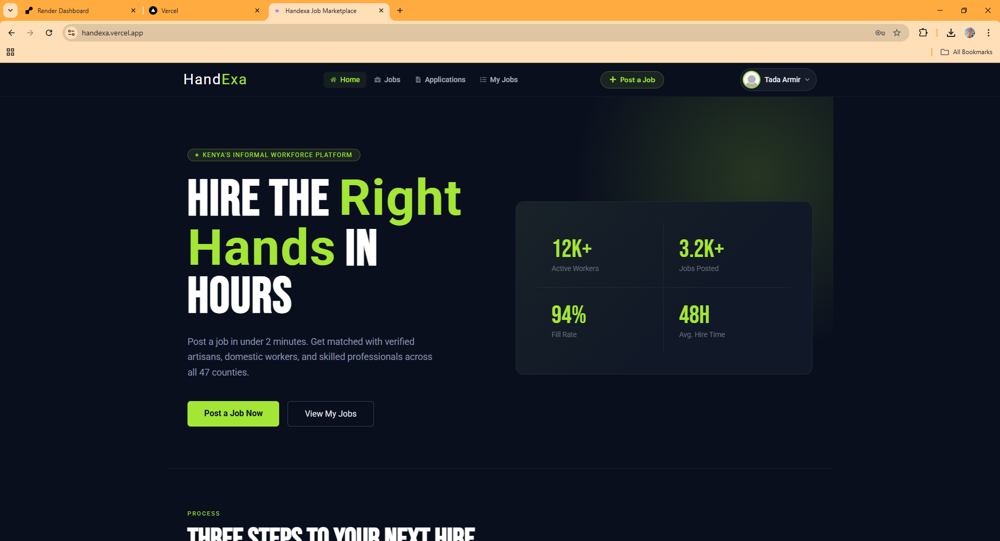
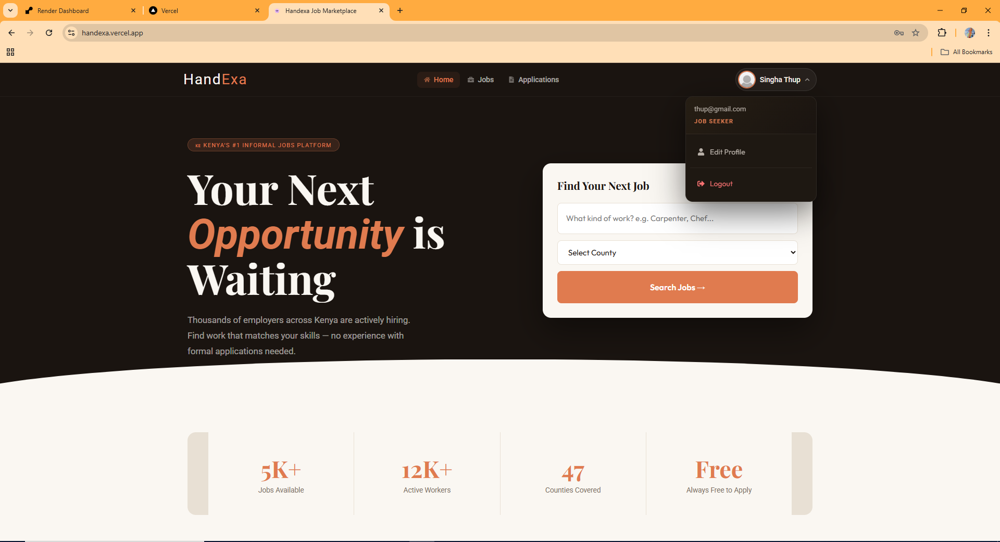
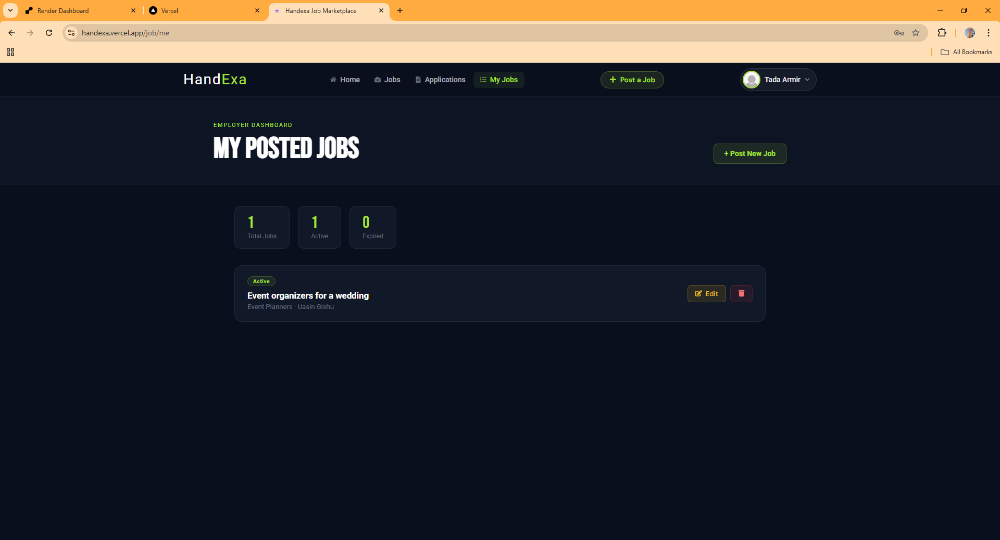

# Handexa Job Marketplace

## 🇰🇪 Overview

**Handexa** is a full-stack MERN web platform designed to connect informal workers in Kenya with employers seeking short-term or task-based services.

The platform enables job seekers and employers to create accounts, interact securely, manage job applications, and handle payments within the system.

Handexa aims to digitize Kenya’s informal job market by providing structure, transparency, and trust.

-

## 🎯 Problem Statement

In Kenya’s informal sector:

* Job opportunities are often shared through word-of-mouth.
* There is no structured application system.
* Payments are frequently delayed or undocumented.
* There is little transparency in hiring decisions.

Handexa addresses these challenges by offering a centralized digital platform where:

* Employers can post jobs
* Workers can apply formally
* Applications can be reviewed transparently
* Communication happens within the system
* Payments are tracked and managed

## 🛠 Tech Stack

### Frontend

* React.js
* React Router
* Axios
* CSS 

### Backend

* Node.js
* Express.js
* MongoDB
* Mongoose
* JWT Authentication
* RESTful API architecture

## 📸 Screenshots

### 🔐 Login Page

### 📝 Signup Page

### 📊 Employer Dashboard

### 📊 JobSeeker Dashboard

### 📊 Job Page

### 📊 Post Job Page

## 🔐 Core Features

### 👤 Role-Based Authentication

Users register as either:

* Employer
* Job Seeker

After login, they are redirected to their respective dashboards.

### 📌 Employer Features

* Post job listings
* View all applications per job
* Accept / Reject / Leave applications pending
* Communicate with selected candidates
* Track payment status (Paid / Unpaid)

### 🧰 Job Seeker Features

* Browse available jobs
* Apply to suitable positions
* View application status (Pending / Accepted / Rejected)
* Communicate with employer after acceptance

-
### 💬 In-App Communication

Once a job application is accepted, both parties can communicate directly within the platform to finalize details.

### 💳 Payment System (In Progress)

The system is being integrated with a payment gateway to allow secure in-platform payments, with status tracking for paid and unpaid jobs.

## 🧠 System Architecture

Handexa follows a client-server architecture:

* The React frontend handles UI rendering and state management.
* The Express backend manages authentication, job posting logic, and application workflow.
* MongoDB stores users, jobs, applications, and transaction records.
* JWT secures protected routes and role-based access.

## 🚀 Vision

Handexa aims to formalize informal employment in Kenya by introducing digital accountability, structured hiring processes, and secure financial transactions.

